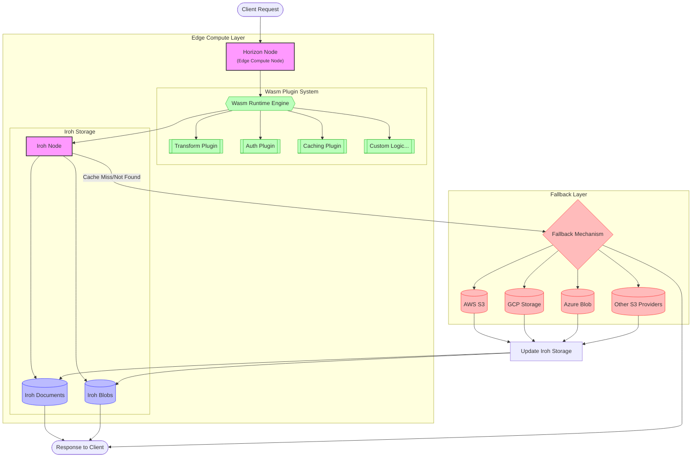

# 🌐 HorizonPush

> 🚧 **Experimental & Work in Progress**: HorizonPush is actively being developed. Expect breaking changes, incomplete features, and evolving APIs.

HorizonPush is a file-sharing and synchronization tool leveraging `iroh` for peer-to-peer transfers and multi-provider blob streaming. It provides an extensible WebAssembly (Wasm) API, integrates with S3 for storage, and includes a Tauri-based desktop application.

## 🏛️ Architecture



## ⭐ Features

- 📂 **Decentralized File Sharing**: Uses `iroh-blobs` for secure, verifiable blob transfers.
- 🔀 **Multi-Provider Blob Streaming**: Enables efficient file distribution by leveraging multiple sources.
- 🧩 **WebAssembly Plugin Support**: Extend functionality with third-party Wasm plugins.
- ☁️ **S3 Integration**: Acts as an S3-compatible storage proxy with local caching.
- 🖥️ **Tauri Desktop App**: Provides a cross-platform, native UI for managing transfers.

## 🧩 WebAssembly API

HorizonPush exposes a Wasm API, allowing developers to extend its functionality with custom plugins. The Wasm runtime has access to:

- 📜 `iroh-docs`: Multi-dimensional key-value document store.
- 📦 `iroh-blobs`: Secure blob transfers with BLAKE3 verification.
- ⚙️ `horizon-sdk`: Helper functions for interacting with HorizonPush internals.

## 📜 iroh Integration with S3

HorizonPush acts as an S3 proxy with intelligent caching:

- 🔄 **S3 API Compatibility**: Supports standard S3 operations (PUT, GET, DELETE).
- 💾 **Local-First Syncing**: Keeps frequently accessed files locally.
- 🗄️ **Transparent Caching**: Moves rarely used files to S3 storage.

## 🖥️ Working with awscli

At the moment signing is not implemented, so if you want to test you should not
sign the request. This will be solved in the near future

1. create a bucket
```sh
aws --endpoint-url http://localhost:3000/s3 s3 mb s3://horizon_bucket --no-sign-request
```

2. copy an object to the bucket
```sh
aws --endpoint-url http://localhost:3000/s3 s3 cp my_test_file.txt s3://horizon_bucket --no-sign-request  
```

3. check the head of the object
```sh
aws --endpoint-url http://localhost:3000/s3 s3api head-object --bucket blutona --key README.md --no-sign-request
```

4. export the bucket ticket for another horizon node
```sh

```

5. import the bucket ticket from another horizon node
```sh
```

5. download the object
```sh
aws --endpoint-url http://localhost:3000/s3 s3 cp s3://horizon_bucket/my_test_file.txt test-download.txt --no-sign-request
```

## 🖥️ Tauri Desktop App

The HorizonPush desktop application provides a native UI for:

- 📂 Managing file transfers
- ⚙️ Configuring S3 settings
- 🧩 Installing and managing Wasm plugins

### ▶️ Running the Tauri App

```sh
cd crates/apps/horizon-push
npm install
npm run tauri dev
```

### ▶️ Running the Horizon Server

```sh
cargo run --bin horizon-push start-server
```

## 🤝 Contributing

Contributions are welcome! Submit issues and pull requests on GitHub.

